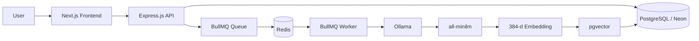
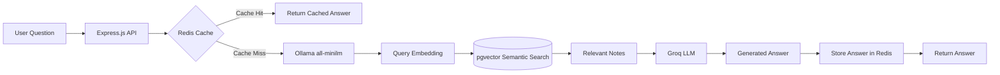
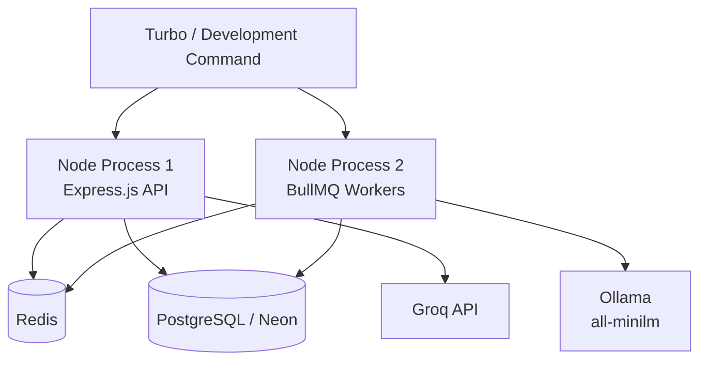

# VectorNote AI

An AI-powered notes application built to explore modern AI and backend engineering concepts including semantic search, RAG, vector embeddings, caching, and asynchronous background processing.

The application stores notes in PostgreSQL and generates 384-dimensional embeddings locally using Ollama and the `all-minilm` model. Embeddings are stored and searched using pgvector, enabling semantic retrieval based on meaning rather than exact keyword matching.

Relevant notes are retrieved and provided as context to a Groq-hosted LLM to generate answers using a Retrieval-Augmented Generation (RAG) pipeline.

Embedding generation is handled asynchronously using BullMQ and Redis, allowing notes to be created immediately while vector processing happens in a separate worker process. Redis is also used for caching repeated AI queries.

## Tech Stack

- Next.js + TypeScript
- Express.js
- PostgreSQL / Neon
- Prisma
- pgvector
- Ollama + all-minilm
- Groq + Vercel AI SDK
- Redis
- BullMQ
- Turborepo
- Docker

## Current Architecture

Note creation:

User → Express API → PostgreSQL → BullMQ → Redis → Worker → Ollama → pgvector

AI question answering:

Question → Ollama embedding → pgvector semantic search → relevant notes → Groq LLM → answer

## Current Features

- Create and manage notes
- Local vector embedding generation
- Semantic note search
- RAG-based question answering
- Redis response caching
- Asynchronous embedding generation with BullMQ
- Separate API and worker processes
- Turborepo-based monorepo architecture

## Planned

- Streaming AI chat interface
- AI tool calling for creating, editing, searching, and deleting notes
- PDF/document ingestion and chunk-based RAG
- Dockerized deployment

## Architecture

VectorNote AI separates synchronous API operations from background AI processing.

### Note Creation & Embedding Pipeline

When a note is created, the API stores the note immediately and queues an embedding-generation job. A separate BullMQ worker processes the job, generates the vector embedding using Ollama and `all-minilm`, and updates the note asynchronously.

### RAG Question Answering Pipeline

The user's question is converted into an embedding using the same embedding model used for notes. pgvector performs semantic similarity search to retrieve the most relevant notes, which are passed to the Groq-hosted LLM as RAG context.

Redis is checked first to avoid unnecessarily repeating expensive AI operations for previously answered queries.

### Process Architecture

The Express API and BullMQ workers run as separate Node.js processes. Turborepo orchestrates the development tasks, while Redis provides both caching and BullMQ queue infrastructure.
